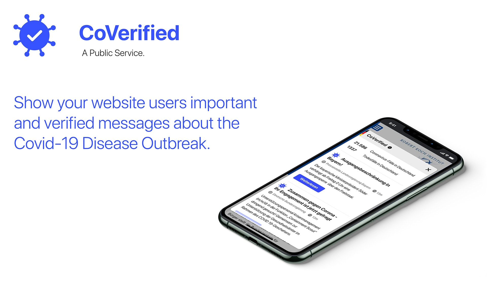
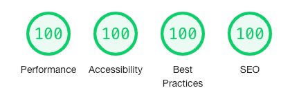

[](https://app.netlify.com/sites/coverified-webcomponent/deploys)

# [CoVerified](https://www.coverified.info/) Web Component

*[CoVerified](https://www.coverified.info/) is a tool to show your websites users important and verified information about the COVID-19 outbreak*

## Simple Integration

It's as easy as adding 
```html
<script async src="https://webcomponent.coverified.info/build/embed.js"></script>
```
to your website. This will load our tool and place it on your website.

We'll take care of updating the information with new, important and verified Data. 100% Fake-News free.

### Fast, secure and accessible

- **Fast**: We made sure that our script is as small as possible - it's only 7.5kb gzipped
- **Secure**: No data is collected - we value your privacy
- **Accessible**: We've optimized the tool for screenreaders and keyboard users



### Customizable

Position it where you want like so:
```css
coverified-widget {
    left: 5rem;
    top: 5rem;
    right: auto;
    bottom: auto;
}
```

Adjust the primary color via CSS custom properties
```css
coverified-widget {
    --color-primary: #bf1e3a;
}
```

## Contribute to fight the virus

*Note that you will need to have [Node.js](https://nodejs.org) installed.*

### Setup

Install the dependencies...

```bash
yarn
```

### Building and running in development mode

...then start [Rollup](https://rollupjs.org):

```bash
yarn dev
```

Navigate to [localhost:5000](http://localhost:5000). You should see your app running. Edit a component file in `src`, save it, and reload the page to see your changes.

By default, the server will only respond to requests from localhost. To allow connections from other computers, edit the `sirv` commands in package.json to include the option `--host 0.0.0.0`.

### Building and running in production mode

To create an optimised version of the app:

```bash
yarn build
```

You can run the newly built app with `yarn start`.

## Code of Conduct

We'd like you to follow our [Code of Conduct](.github/CODE_OF_CONDUCT.md)

---


This project was [initially started](https://devpost.com/software/1_039_c_staatlichekommunikation_webinfowidget) during the [#wirvsvirus hackathon](https://twitter.com/hashtag/WirVsVirusHack)
